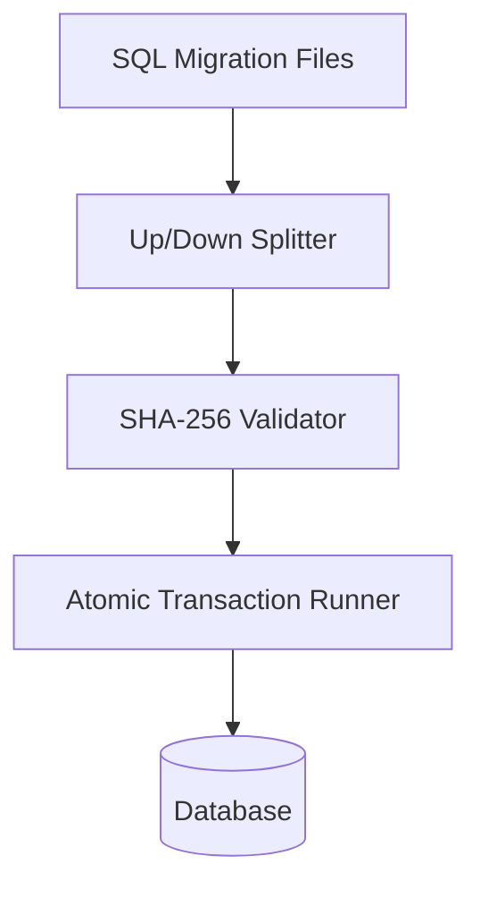

# Architecture

```mermaid
flowchart TD
    Files[SQL Migration Files] --> Parser[Up/Down Splitter]
    Parser --> Checksum[SHA-256 Validator]
    Checksum --> Runner[Atomic Transaction Runner]
    Runner --> DB[(Database)]
```
